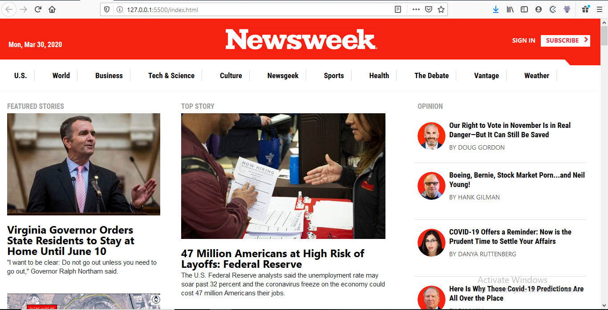

# Newsweek Clone

> This is an attempt at building the Newsweek Home page using Bootstrap. Most of the responsiveness was handled by Bootstrap, though some media queries were still required to style the header for different screen sizes. It's a great demonstration of the power of Bootstrap classes, and how a few classes in the HTML document can control how the page renders at different screen sizes

## Built With

- HTML 5,
- CSS 3,
- Bootstrap 4

## Live Demo

[Live Demo Link](https://livedemo.com)

## Built By:

👤 **Ramsey Njire**

- Github: [@RamseyNjire](https://github.com/RamseyNjire)
- Twitter: [@untakenramram](https://twitter.com/untakenramram)
- Linkedin: [Ramsey Njire](https://www.linkedin.com/in/ramsey-njire-51984931/)
## 🤝 Contributing

Contributions, issues and feature requests are welcome!

Feel free to check the [issues page](https://github.com/RamseyNjire/the-news-week-clone/issues?q=is%3Aissue+is%3Aopen+sort%3Aupdated-desc).

## Show your support

Give a ⭐️ if you like this project!

## 📝 License

This project is [MIT](lic.url) licensed.
